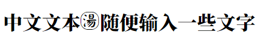
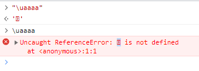

# 图片生成字体

- [使用FontCreator打造属于自己的字体](http://t.csdn.cn/RXRIa)
- [通过Unicode输入字符](https://zhuanlan.zhihu.com/p/484402491)

## 1. FontCreator

- 下载安装FontCreator，打开已安装的字体包。（要是有能力新建一个就不需要看这个了）。系统字体包默认位置：`C:\Windows\Fonts`
- 如果是替换已有文字，比如`汤`，找到它的unicode为`\u6C64`，在该软件写法为`$6C64`，搜索【`Ctrl` + `F`】、右键编辑、全选【`Ctrl` + `A`】、删除【`Delete`】，叉掉再右键导入图像。
- 如果是新建一个字，随便找个不常用字（比如生僻字`$9FDF`鿟）进行上一步操作，右键导入图片。
- 注意：设置不常见字符code后，若没有安装该字体包，可能显示乱码`ꪪ`。
- 另存为，自己取个名字以作区分。安装到电脑，我先不装，用html演示。
- 在html中引入字体包，输入`汤`字，效果如下：
- `
中文文本汤随便输入一些文字
`
- 
- 显然位置有偏差，就在字体中找到该字，右键编辑，全选，拖移调整。

## 2. 输入法打出

- 微软拼音可以通过unicode直接设置，看[通过Unicode输入字符](https://zhuanlan.zhihu.com/p/484402491)
- 搜狗输入法，更多设置、属性设置、高级、自定义短语、添加新短语，比如我这里缩写设为`t`
- 把上面的unicode拿过来，把`$`换成`\u`，在浏览器中随便打开个页面按F12，选择控制台（console），用英文引号括起来，比如`"\u9FDF"`，别用中文引号`“\u9FDF”`，下一行就会出现`ꪪ`或`鿟`，不要下面的单引号，把乱码复制到输入法的自定义短语里
- 或者不用引号也行，能复制就可以。我是前端，习惯用浏览器，要是有别的工具能实现也一样。
- 
- 注意，显示都是`ꪪ`，但它们不一定是同一个字符
- 下次用搜狗输入法，打`t`它就出现了
- 其他未安装该字体包的设备，比如其他电脑手机打印机，显示出来的还是`ꪪ`或`鿟`。

## 3. 常用字符unicode范围（16进制）

- 基本拉丁文字符（Basic Latin）：U+0000至U+007F
- 拉丁文-1补充字符（Latin-1 Supplement）：U+0080至U+00FF
- 拉丁文扩展-A字符（Latin Extended-A）：U+0100至U+017F
- 拉丁文扩展-B字符（Latin Extended-B）：U+0180至U+024F
- 摩斯科尼字符（Miscellaneous）：U+0250至U+02AF
- 拉丁文扩展增补字符（Latin Extended Additional）：U+1E00至U+1EFF
- 一般标点符号（General Punctuation）：U+2000至U+206F
- 上标及下标字符（Superscripts and Subscripts）：U+2070至U+209F
- 货币符号（Currency Symbols）：U+20A0至U+20CF
- 字母变音符号（Combining Diacritical Marks）：U+0300至U+036F
- 数学运算符号（Mathematical Operators）：U+2200至U+22FF
- 中日韩统一表意文字（CJK Unified Ideographs）：U+4E00至U+9FFF
- 中日韩统一表意文字扩展A（CJK Unified Ideographs Extension A）：U+3400至U+4DBF
- 中日韩统一表意文字扩展B（CJK Unified Ideographs Extension B）：U+20000至U+2A6DF
- 中日韩统一表意文字扩展C（CJK Unified Ideographs Extension C）：U+2A700至U+2B73F
- 中日韩统一表意文字扩展D（CJK Unified Ideographs Extension D）：U+2B740至U+2B81F
- 中日韩统一表意文字扩展E（CJK Unified Ideographs Extension E）：U+2B820至U+2CEAF
- 中日韩统一表意文字扩展F（CJK Unified Ideographs Extension F）：U+2CEB0至U+2EBEF
- 中日韩统一表意文字扩展G（CJK Unified Ideographs Extension G）：U+30000至U+3134F