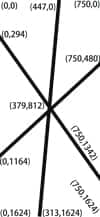
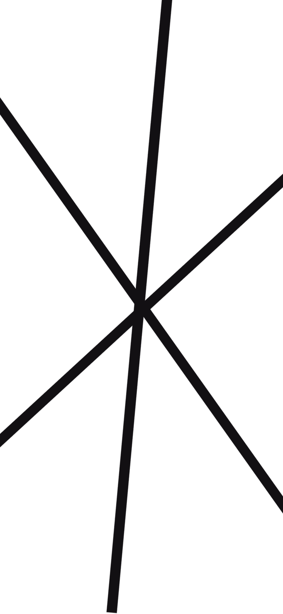

# 不规则div点击事件

> 现有一个图片素材：划分为多个区域，分别点击触发对应事件
>
> 先在PS中找出各个转折点的坐标（相对左上角）则六个区域的顶点坐标如下：



<style>
.box{
    width: 76px;
    height: 163px;
    overflow: hidden;
}
.box>div{
    transform: translate(-45%, -45%) scale(0.1);
}
</style>

## 一、div旋转、层级

> 设置多个div，旋转实现，要是不够，可适当多个拼接。笨方法，知识要求低，调整很麻烦。

```css
#test1 {
    width: 750px;
    height: 1624px;
    position: relative;
    overflow: hidden;
    background-image: url(./img/899_bg.png);
    border: 1px solid;
}

#test1 > div {
    /*border: 1px solid red;*/
    height: 100px;
    width: 100px;
    position: absolute;
}

#test1 > div:nth-child(1) {
    width: 444px;
    height: 800px;
    top: -39px;
    transform-origin: top left;
    transform: rotate(5deg);
    z-index: 1;
}

#test1 > div:nth-child(2) {
    left: 468px;
    top: -31px;
    width: 347px;
    height: 831px;
    transform-origin: top left;
    transform: rotate(6deg);
    z-index: 2;
}

#test1 > div:nth-child(3) {
    transform-origin: top left;
    transform: rotate(54deg);
    top: 304px;
    width: 637px;
    height: 477px;
    z-index: 3;

}

#test1 > div:nth-child(4) {
    transform-origin: top left;
    transform: rotate(47deg);
    top: 324px;
    left: -89px;
    width: 674px;
    height: 518px;
    z-index: 3;
}

#test1 > div:nth-child(5) {
    top: 829px;
    z-index: 4;
    left: 375px;
    transform-origin: top left;
    transform: rotate(46deg);
    width: 453px;
    height: 750px;

}

#test1 > div:nth-child(6) {
    top: 839px;
    z-index: 5;
    transform-origin: left;
    transform: rotate(5deg);
    left: 342px;
    text-align: right;
    width: 450px;
    height: 794px;
}

#test1 > div:nth-child(7) {
    top: 815px;
    z-index: 6;
    left: 391px;
    transform-origin: left top;
    transform: rotate(-37deg);
    width: 469px;
    height: 664px;
}

#test1 > div:nth-child(8) {
    z-index: 6;
    left: 388px;
    top: 812px;
    transform-origin: left top;
    transform: rotate(-43deg);
    width: 488px;
    height: 536px;
}
```

```js
function box(i) {
    console.log("点击的第" + i + "个")
}
```

```html

<div id="test1">
    <div onclick="box(1)">1</div>
    <div onclick="box(2)">2</div>
    <!--    <div onclick="box(2)">2</div>-->
    <div onclick="box(3)">3</div>
    <div onclick="box(3)">3</div>
    <div onclick="box(4)">4</div>
    <div onclick="box(5)">5</div>
    <div onclick="box(6)">6</div>
    <div onclick="box(6)">6</div>
</div>
```

示例：(点击各区域查看控制台)

---
<style>
    #test1 {
        width: 750px;
        height: 1624px;
        position: relative;
        overflow: hidden;
        background-image: url(./img/899_bg.png);
        border: 1px solid;
        /*transform: scale(0.1);*/
    }

    #test1 > div {
        /*border: 1px solid red;*/
        height: 100px;
        width: 100px;
        position: absolute;
    }

    #test1 > div:nth-child(1) {
        width: 444px;
        height: 800px;
        top: -39px;
        transform-origin: top left;
        transform: rotate(5deg);
        z-index: 1;
    }

    #test1 > div:nth-child(2) {
        left: 468px;
        top: -31px;
        width: 347px;
        height: 831px;
        transform-origin: top left;
        transform: rotate(6deg);
        z-index: 2;
    }

    #test1 > div:nth-child(3) {
        transform-origin: top left;
        transform: rotate(54deg);
        top: 304px;
        width: 637px;
        height: 477px;
        z-index: 3;

    }

    #test1 > div:nth-child(4) {
        transform-origin: top left;
        transform: rotate(47deg);
        top: 324px;
        left: -89px;
        width: 674px;
        height: 518px;
        z-index: 3;
    }

    #test1 > div:nth-child(5) {
        top: 829px;
        z-index: 4;
        left: 375px;
        transform-origin: top left;
        transform: rotate(46deg);
        width: 453px;
        height: 750px;

    }

    #test1 > div:nth-child(6) {
        top: 839px;
        z-index: 5;
        transform-origin: left;
        transform: rotate(5deg);
        left: 342px;
        text-align: right;
        width: 450px;
        height: 794px;
    }

    #test1 > div:nth-child(7) {
        top: 815px;
        z-index: 6;
        left: 391px;
        transform-origin: left top;
        transform: rotate(-37deg);
        width: 469px;
        height: 664px;
    }
    #test1 > div:nth-child(8) {
        z-index: 6;
        left: 388px;
        top: 812px;
        transform-origin: left top;
        transform: rotate(-43deg);
        width: 488px;
        height: 536px;
    }
</style>

<div class="box">
<div id="test1">
    <div onclick="box(1)">1</div>
        <div onclick="box(2)">2</div>
    <!--    <div onclick="box(2)">2</div>-->
        <div onclick="box(3)">3</div>
        <div onclick="box(3)">3</div>
        <div onclick="box(4)">4</div>
        <div onclick="box(5)">5</div>
        <div onclick="box(6)">6</div>
        <div onclick="box(6)">6</div>
</div>
</div>
<script>
    function box(i) {
        console.log("点击的第" + i + "个")
    }
</script>

## 二、map

> `coords`的属性值单位是`px`，适配屏幕时，要重新计算。参考[获取px值](./996.html#获取px值)

```html

<div id="myDiv">
    
    <map name="myMap">
        <!-- 在这里添加具体的非长方形区域 -->
        <area shape="poly" coords="x1,y1,x2,y2,x3,y3,..." href="#" alt="区域1">
        <area shape="poly" coords="x1,y1,x2,y2,x3,y3,..." href="#" alt="区域2">
        <area shape="poly" coords="x1,y1,x2,y2,x3,y3,..." href="#" alt="区域3">
        ...
    </map>
</div>

```

```js
let areas = document.querySelectorAll('#myDiv area');
areas.forEach(function (area, index) {
    area.addEventListener('click', function (event) {
        event.preventDefault();
        console.log(area.alt, index);
    })
})
```

示例：

---

<div class="box">
    <div id="test2">
      
      <map name="myMap">
        <!-- 在这里添加具体的非长方形区域 -->
        <area shape="poly" coords="0,0,447,0,379,812,0,294" href="javascript:void(0)" alt="区域1">
        <area shape="poly" coords="447,0,379,812,750,480,750,0" href="javascript:void(0)" alt="区域2">
        <area shape="poly" coords="0,294,379,812,0,1164" href="javascript:void(0)" alt="区域3">
        <area shape="poly" coords="0,1164,379,812,313,1624,0,1624" href="javascript:void(0)" alt="区域4">
        <area shape="poly" coords="379,812,313,1624,750,1624,750,1342" href="javascript:void(0)" alt="区域5">
        <area shape="poly" coords="379,812,750,1342,750,480" href="javascript:void(0)" alt="区域6">
      </map>
    </div>
</div>

<style>
#test2{
    border: 1px solid;
     width: 750px;
        height: 1624px;
}
#test2>img{
    width: 750px;
}
</style>

<script>
let areas = document.querySelectorAll('#test2 area');
areas.forEach(function (area,index) {
    area.addEventListener('click', function (event) {
        event.preventDefault();
        console.log(area.alt,index);
    })
})
</script>

## 三、数学函数

> 让父级div触发同一个点击事件，然后判断点击的位置，代入预设好的数学函数中，满足哪个，就触发其方法。
> 
> 这里示例设置的是`transform: scale(0.1);`，缩小后对点击完全无影响。如果用的rem导致宽高自适应变化时，应该不行，待测。

````js
function findLineEquation(x1, y1, x2, y2) {
    let a = (y2 - y1) / (x2 - x1);
    let b = y1 - a * x1;
    return (x, y) => {
        let _y = a * x + b;// _y=f(x)
        return y < _y; // 点击位置是否在直线的上方
    };
}

// 三条直线的函数：
let f1 = findLineEquation(0, 294, 750, 1342);
let f2 = findLineEquation(447, 0, 313, 1624);
let f3 = findLineEquation(0, 1164, 750, 480);

document.getElementById("test3").addEventListener("click", function (event) {
    let x = event.offsetX;
    let y = event.offsetY;
    console.log("点击位置的坐标： x=" + x + ", y=" + y);
    let b1 = f1(x, y);// 点击位置是否在f1的上方
    let b2 = f2(x, y);
    let b3 = f3(x, y);
    console.log(b1,b2,b3);
    if(b1&&b2){
        console.log(1);
    }else if(!b2 && b3){
        console.log(2);
    }else if(!b1 && b3){
        console.log(3);
    }else if(b2 && !b3){
        console.log(4);
    }else if(!b1 && !b2){
        console.log(5);
    }else if(b1 && !b3){
        console.log(6);
    }else{
        console.log("边框？还是逻辑错误？");
    }
});
````

示例：

---

<style>
#test3{
    width: 750px;
    height: 1624px;
    background-image: url("./img/899_bg.png");
    border: 1px solid;
}
</style>

<div class="box">
   <div id="test3"></div>
</div>


<script>
function findLineEquation(x1, y1, x2, y2) {
    let a = (y2 - y1) / (x2 - x1);
    let b = y1 - a * x1;
    return (x, y) => {
        let _y = a * x + b;
        return  y < _y;
    };
}

// 三条直线的函数：
let f1 = findLineEquation(0, 294, 750, 1342);
let f2 = findLineEquation(447, 0, 313, 1624);
let f3 = findLineEquation(0, 1164, 750, 480);

document.getElementById("test3").addEventListener("click", function (event) {
    let x = event.offsetX;
    let y = event.offsetY;
    console.log("点击位置的坐标： x=" + x + ", y=" + y);
    let b1 = f1(x, y);// 点击位置是否在f1的上方
    let b2 = f2(x, y);
    let b3 = f3(x, y);
    console.log(b1,b2,b3);
    if(b1&&b2){
        console.log(1);
    }else if(!b2 && b3){
        console.log(2);
    }else if(!b1 && b3){
        console.log(3);
    }else if(b2 && !b3){
        console.log(4);
    }else if(!b1 && !b2){
        console.log(5);
    }else if(b1 && !b3){
        console.log(6);
    }else{
        console.log("边框？还是逻辑错误？");
    }
});
</script>

## 四、css

> 参考[CSS clip-path 属性](https://www.runoob.com/cssref/pr-clip-path.html)